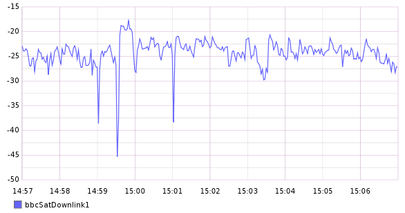

axia-loudness-graphite-client
=============================
An <a href = "https://tech.ebu.ch/docs/events/ibc11-ebutechnical/presentations/ibc11_10things_r128.pdf">EBU R128</a> loudness meter for <a href = "http://www.axiaaudio.com/livewire">Axia Livewire</a>, an AoIP standard used in broadcast. The client subscribes to an Axia channel's multicast UDP/RTP stream, computes its EBU R128 short-term loudness measurement, and sends the results to your <a href = "http://graphite.readthedocs.org/en/latest/overview.html">Graphite</a> server via its <a href = "http://graphite.readthedocs.org/en/latest/feeding-carbon.html#the-plaintext-protocol">plaintext protocol</a>. Resolution is one measurement per second.  Very useful for loudness logging, visualization, or putting together a dashboard.

Correct usage: `axialufsgraphite <MC Livewire IP> <Graphite Server IP> <Graphite Metric>`

Example: `axialufsgraphite 239.192.2.169 127.0.0.1 bbcSatDownlink1`

</img>
